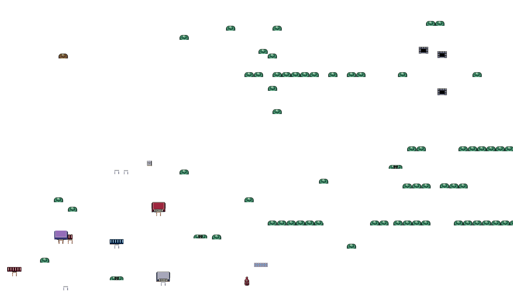
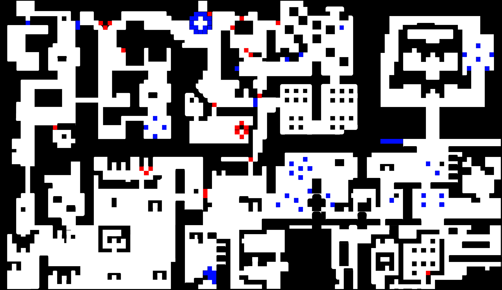

<div align="center">
    
</div>

# RPG

[](https://github.com/DoctorPok42/RPG/actions/workflows/rpg.yml)

## Description

RPG is a simple role-playing game written in C.

It is a school project for the first year at Epitech.

We based our game on the game Link's Awakening.

We used the same map, the same sprites and the same music.

## Installation

### Linux

```bash
$ git clone git@github.com:EpitechPromo2027/B-MUL-200-BDX-2-1-myrpg-remi.mazat.git
$ cd B-MUL-200-BDX-2-1-myrpg-remi.mazat
$ make
$ ./my_rpg
```

## Explanation

### 3D Isometric

We used the 3D isometric projection to display the map.

We used another map to display the map in 3D. This map have just the sprite that we want in 3D (like the trees and the houses).



### Colision

The colision is based on the pixel perfect colision. It means that the colision is based on the alpha channel of the sprite. If the alpha channel is equal to 0, it means that the pixel is opaque and the player can't go through it. Else, the player can go through it.

We use a another map to check the colision. This map is a copy of the map but with the alpha channel of the sprite.



## Usage

### Controls

-   `flèches directionnelles` to move
-   `E` to interact
-   `ESC` to pause the game

### Gameplay

The goal of the game is to reach the end of the map. You can interact with objects by pressing `E` when you are close enough to them. You can also talk to NPCs by pressing `E` when you are close enough to them. You can pause the game by pressing `ESC`.

## Technical

- C
- CSFML

## Folder structure

-   `assets/` contains all the assets of the game
-   `include/` contains all the header files
-   `lib/` contains all the libraries used in the project
-   `src/` contains all the source files
-   `src/utils/create/` contains all the source files to create the game
-   `src/utils/display/` contains all the source files to display the game
-   `src/utils/event/` contains all the source files to handle the events

## Authors

- [Periicles](https://github.com/Periicles)
- [antoinefilleul](https://github.com/antoinefilleul)
- [JBStoquer](https://github.com/JBStoquer)
- [DoctorPok42](https://github.com/DoctorPok42)
